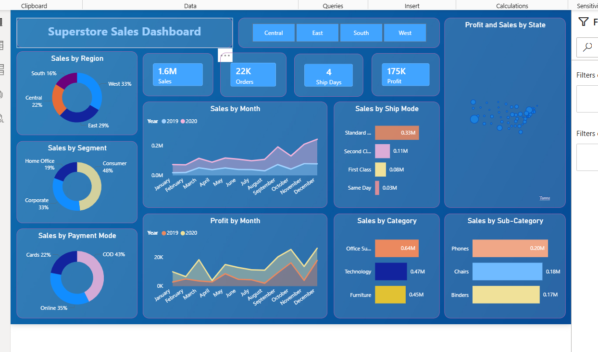
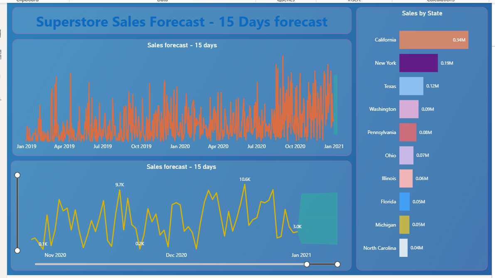

# superstore-analytics
Built an interactive Superstore Sales Analytics Dashboard using Power BI, Python, SQL, and Excel. Analyzed sales, profit, orders, customer segments, and regional performance. Developed sales forecasting models and dynamic visualizations to identify trends, optimize business decisions, and track KPIs.
# Superstore Sales Analytics Dashboard

## Project Overview
This project presents an interactive sales analytics dashboard designed to analyze sales performance, profit trends, customer segments, regional performance, and product categories. The dashboard provides actionable business insights and includes sales forecasting to support data-driven decision-making.

## Tools & Technologies
- Power BI
- Python
- Pandas
- NumPy
- SQL
- Excel

## Key Features
- Sales & Profit Analysis
- Regional Performance Tracking
- Category & Sub-Category Analysis
- Customer Segment Analysis
- Sales Forecasting
- Ship Mode & Payment Mode Analysis
- Interactive Filters and KPIs

## Dashboard Metrics
- Total Sales
- Total Profit
- Total Orders
- Sales by Region
- Sales by State
- Sales by Category
- Sales by Segment
- Monthly Sales & Profit Trends

## Key Insights
- Identified top-performing regions and states.
- Analyzed profitability across product categories.
- Tracked monthly sales and profit trends.
- Evaluated customer purchasing behavior by segment.
- Forecasted future sales trends to support business planning.
- Compared performance across shipping modes and product categories.

## Dashboard Preview

### Sales Overview Dashboard


### Sales Forecast Dashboard


## Project Structure

```
Superstore-Sales-Analytics-Dashboard/
│
├── Dashboard.pbix
├── Superstore_Dataset.csv
├── SS1.png
├── SS2.png
└── README.md
```

## Skills Demonstrated
- Data Cleaning
- Data Analysis
- SQL Querying
- Sales Analytics
- Business Intelligence
- Dashboard Development
- Data Visualization
- Forecasting
- KPI Reporting

## Author
Ghanshyam Rajput
